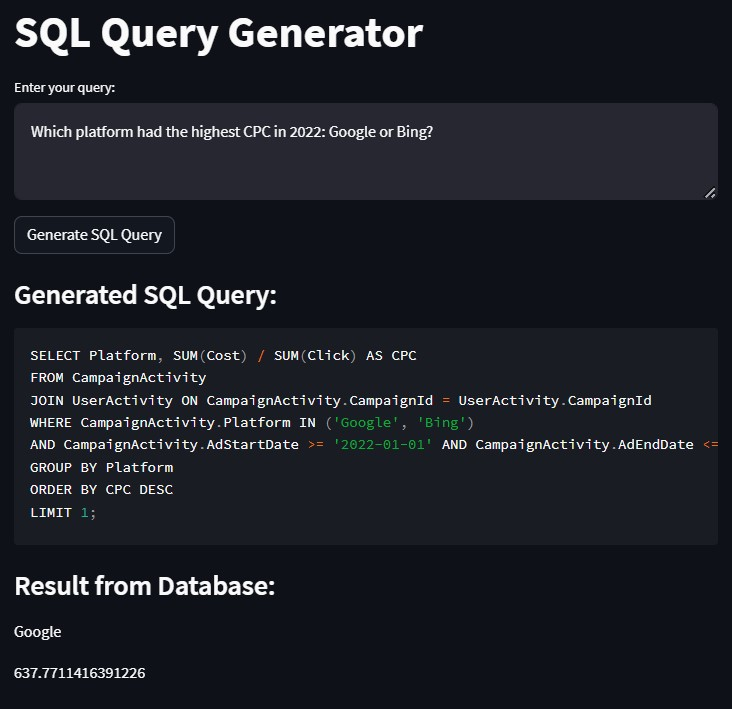

# Text to SQL Application

This repository contains a Text to SQL application that efficiently converts natural language text input about a marketing database into the correct SQL query.

## Application Diagram

## Evaluation

![Example][evaluation.png]

## Table of Contents

- [Introduction](#introduction)
- [Database Structure](#database-structure)
- [Models and Libraries](#models-and-libraries)
- [Application Interface](#application-interface)
- [Getting Started](#getting-started)
- [Contributing](#contributing)
- [License](#license)

## Introduction

This Text to SQL application simplifies the process by allowing you to express your queries in plain English. It leverages the power of OpenAI's gpt-3.5-turbo model, with a window size of 4,096 tokens, and LangChain.ai to accurately interpret your natural language queries.

## Database Structure

The underlying database for this application is built in ClickHouse and comprises the following tables:

1. **Agency Customers**: This table stores information about customers associated with the marketing agency. It includes the following columns:
   - CustomerId (Primary Key)
   - Name
   - Email
   - Status
   - CreatedAt

2. **Users**: The Users table contains details about the users of the marketing platform. It has the following columns:
   - UserId (Primary Key)
   - RegDate
   - Status

3. **UserActivity**: This table tracks the activity of users on the marketing platform. It includes the following columns:
   - VisitId (Primary Key)
   - UserId
   - VisitDate
   - ThroughClick
   - CampaignId

4. **CampaignActivity**: The CampaignActivity table stores information related to marketing campaigns. It has the following columns:
   - CampaignId (Primary Key)
   - Platform
   - AdStartDate
   - AdEndDate
   - Cost

## Models and Libraries

The Text to SQL application is built upon the following models and libraries:

- **OpenAI's gpt-3.5-turbo**
- **LangChain.ai**

## Application Interface

To make the Text to SQL application user-friendly and easily accessible, it is wrapped using Streamlit. 

## Getting Started

To run the Text to SQL application locally, follow these steps:

1. Clone this repository: `git clone https://github.com/your-username/your-repo.git`
2. Install the required dependencies: `pip install -r requirements.txt`
3. Start the application: `streamlit run app.py`
4. Access the application in your browser at `http://localhost:8501`